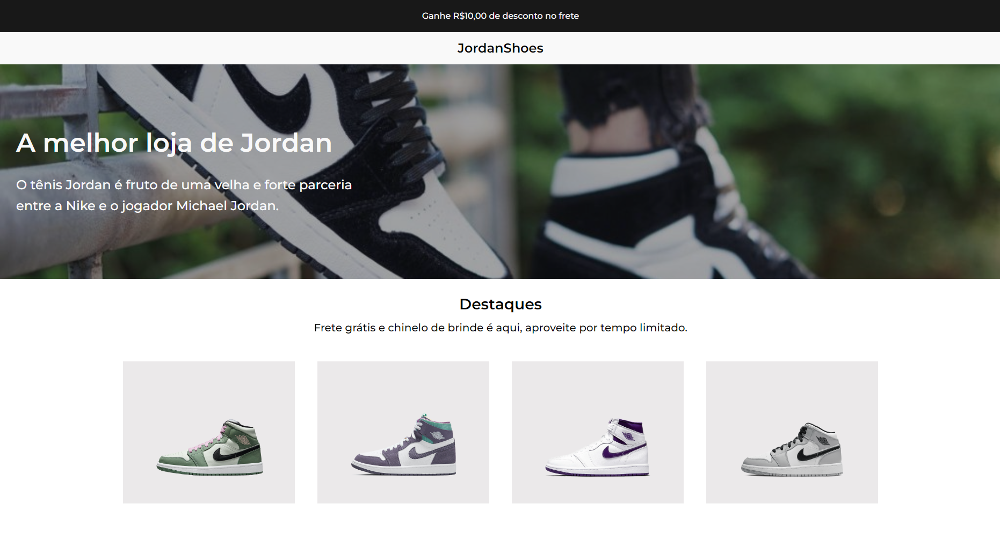

# # Desafio 02 da comunidade Codelândia do [iuricode](https://github.com/iuricode)

## 🛠️ Tecnologias

- HTML
- CSS

*Responsivo ✔️*

## 🎯 Objetivo

- Desenvolver o projeto de acordo com o layout disponibilizado no figma.

## 👨‍💻 Visualização do projeto

 <h3 align="center"><a href="https://desafiojordanshoes.netlify.app">Acessar o site</a></h3>

